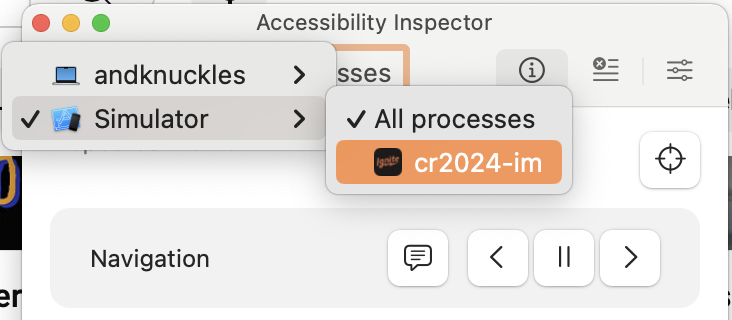
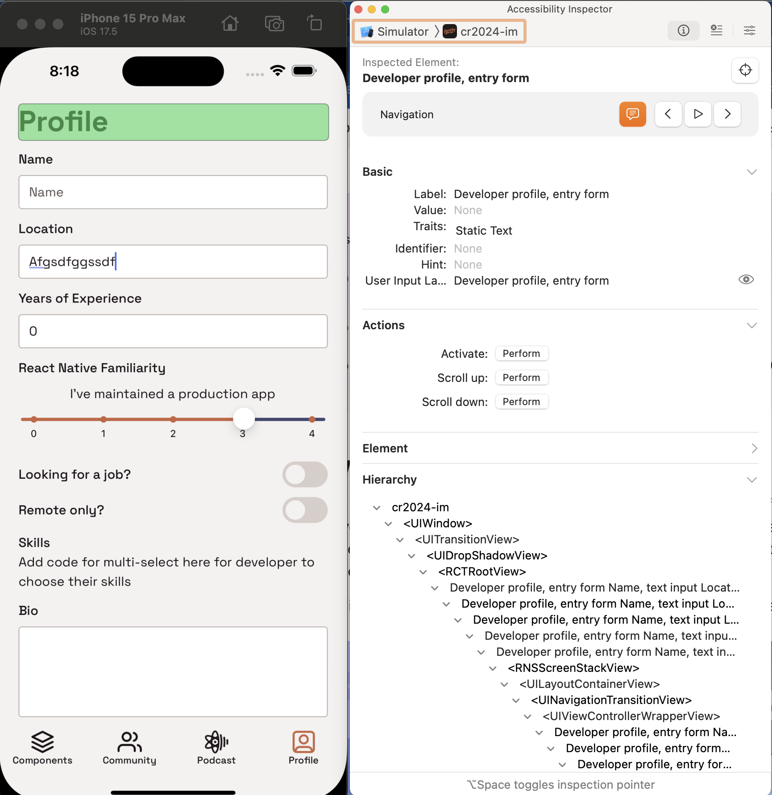

# Module 03: Accessibility Timebox

### Goal

How much of our developer profile form can we make accessible before lunch?

### Concepts

- Experience your form with Talkback / Voiceover
- Use accessibility features so the inputs are clearly identified as the user scrolls down the screen and changes focus

<!-- Talkback / Voiceover work in emulators/simulators, right? Is it better to focus on devices here? -->

### Features to build

- Make the developer profile tab as accessible as possible, facilitating smoothly navigating through the input fields using voice narration.

### Resources

- iOS
  - [Turning on VoiceOver on your iPhone](https://support.apple.com/guide/iphone/turn-on-and-practice-voiceover-iph3e2e415f/ios)
  - [VoiceOver gestures](https://support.apple.com/guide/iphone/use-voiceover-gestures-iph3e2e2281/ios)
  - [Accessibility Inspector](https://developer.apple.com/documentation/accessibility/accessibility-inspector)
- Android
  - [Turn on TalkBack](https://support.google.com/accessibility/android/answer/6007100?sjid=2466709077556310384-NA)

# Philosophy

This lesson is a little different from the others. We have some suggested code in here, and suggested areas you should cover when considering the accessibility of the form, but each platform has different capabilities, and there's general guidelines and recommendations and best practices for accessibility, but the operation requires some nuance. You are _describing_ for form; some people may describe it a bit differently. We provide ideas in the form of code snippets, but feel free to customize them as you experience the accessibility of the form itself. If you find a better option, we would love to talk about it as a group.

We will also be using primarily standard React Native component accessibility props. There are libraries that can help streamline building accessibility into your UI design process that may be a better fit for your project. But, it's also important to learn what's under the hood, what are the core capabilities that mobile developers lean on.

# Exercises

## Exercise 0: Experiencing accessibility tools

To get going on addressing accessibility, it's first important to get the tools working that you'll need to experience accessibility. You may be able to get to a second platform during this exercise, but first start by picking one to focus on and getting through that, as each experience will be a little different.

If you are able to use a device for development, this is the one situation where a device is going to be more realistic than the simulator. However, you can also get a lot of essential data about your app's accessibility through the iOS simulator, and it's probably the easiest way to get started, so let's go with that. If you need to use Android, note that you will have to use an Android device in order to access and troubleshoot your app's narration-based accessibility.

### iOS simulator

The iOS simulator doesn't support VoiceOver directly, but it can be used with the macOS Accessibility Inspector.

Search for "Accessibility Inspector" in Spotlight; it should already be there.

Set it to inspect the workshop app on your simulator:

[](./assets/05/accessibility-inspector-1.png)

Switch to the Profile tab, make sure the speech bubble is turned on, and press play. It will cycle through the inputs. You can also pause it and go back and forth with the arrows.

[](./assets/05/accessibility-inspector-2.png)

> Real VoiceOver tends to respond a little better when it comes to narration within your control. For instance, VoiceOver will provide updates as the slider value is changed, but Accessibility Inspector will not. However, you can approximate the results by moving to the previous control and back again after changing the value. One thing that is helpful about Accessibility Inspector is that touch interactions on the simulator largely stay the same as with VoiceOver off.

### iOS device (optional)

You can do basically everything in this module with Accessibility Inspector, but at some point in app development, you need to move over to VoiceOver to understand how accessibility features work in practice.

You can set an accessibility key (e.g., turn on VoiceOver on triple press of the side key) on your iPhone, or you can turn on VoiceOver from the Control Center.

Learn more:

- [Turning on VoiceOver on your iPhone](https://support.apple.com/guide/iphone/turn-on-and-practice-voiceover-iph3e2e415f/ios)
- [VoiceOver gestures](https://support.apple.com/guide/iphone/use-voiceover-gestures-iph3e2e2281/ios)

Common gestures:

- Swipe right: go to next control
- Swipe left: go to previous control
- Single tap: focus control
- Double tap: select / interact with control
- ???: Go to home screen

> Use `npx expo run:ios --device` to build the app to your USB-connected device.

### Android device

You can use TalkBack on an Android emulator, but it's already installed on your Android phone, so that might be easier. Follow the directions to enable TalkBack. It's recommended that you enable the TalkBack shortcut. This will put a persistent button on your screen that lets you turn TalkBack on and off quickly.

Learn more:

- [Turning on TalkBack / enable the TalkBack shortcut](https://support.google.com/accessibility/android/answer/6007100?sjid=17339591389191507281-NA)
- [TalkBack overview](https://support.google.com/accessibility/android/answer/6283677?hl=en).
- [Installing TalkBack on an Android emulator](https://reactnative.dev/docs/accessibility#testing-talkback-support-android)

Common gestures:

- Swipe right: go to next control
- Swipe left: go to previous control
- Single tap: focus control
- Double tap: select / interact with control
- ???: Go to home screen

> Use `npx expo run:android --device` to build the app to your USB-connected device.

### Test accessibility

Whatever tool you use, since we're focusing on making the Profile tab more accessible, you'll want to cycle through narration on that tab, noting what works well and what doesn't. Also consider the tab navigation itself.

🏃**Try it.** Cycle through the controls on the Profile tab. How would it feel to use this if you depended on the accessibility tools?

## Exercise 1: Text and text inputs

You may have noticed that the narration from the screen reader sounds like a bunch of random words: "Profile, Name Name, Years of Experience, Years of Experience", etc. It doesn't tell you what the fields are, or even the purpose of the form, or even if it is a form.

### Describe this thing like a normal person, please?

First things, first - what are we even focused on. Let's use simple `accessibilityLabel` props to describe the "Profile" a bit better. Even if we don't do anything else, at least someone could understand that this is an entry form, that it is a place for you to enter information about you, the developer.

#### Try these, or something like it:

- Add an `accessibilityLabel` to the `Text` component displaying the "Profile" heading, like:

```tsx
<Text
  preset="heading"
  tx="demoProfileScreen.title"
  style={$title}
  accessibilityLabel="Developer profile, entry form"
/>
```

- Consider if it's even clear what a "Profile" is to someone who doesn't need voice narration. Considering context and if it needs to be spelled out can be good for everyone, depending on the situation, you could add a subheading describing the form under the heading, like:

```tsx
<Text
  preset="heading"
  text="Enter your developer profile to let us know what you'd like to work on and what React Native Radio episodes you'd like to hear"
/>
```

### Text Inputs that describe themselves as such

What is a "Name Name"? Clearly, this description will not do.

1. Try adding an `accessibilityLabel` to the name `TextField` to see what happens. Does anything change?

`TextField` isn't a stock React Native component. It does pass additional props to the underlying `TextInput`, but that alone will not have the effect you're looking for. So, let's crack open `TextField` and see how we can modify it to describe itself well.

First off, the whole thing is wrapped by a `TouchableOpacity`. This is actually why it already sounds a little better than it would if it was just a separate `Text` and `TextInput`. By default, buttons have `accessible` set to true, [which means they behave as a container that should treat the child components as a single component for the purposes of accessibility](https://reactnative.dev/docs/accessibility#accessible).

But, the `Text` and `TextInput` controls are announcing their contents and their placeholders, respectively. Hence, "Name Name". One simple way to get it to stop repeating itself is to get rid of one of these.

2. In `TextField`, the `Text` component is optional, so let's stop it from announcing itself by giving it a blank label:

```diff
<Text
+  accessibilityLabel=""
  importantForAccessibility="no-hide-descendants"
  preset="formLabel"
  text={label}
  tx={labelTx}
```

🏃**Try it.** Less repetitive, huh?

3. It's still difficult to understand what is "Name", though. Here's an idea. Add an explicit `accessibilityLabel` prop to the type definition for `TextField`. Update the `TextInput` inside to use the `accessibilityLabel` if its available, and fall back to displayed label if it's not:

```diff
<TextInput
+  accessibilityLabel={`${accessibilityLabel || (labelTx ? translate(labelTx!, labelTxOptions) + ", text input" : "") }`}
  ref={input}
```

> You'll also need to import `translate` from `src/i18n`. This will turn those i18n labels into the text that needs to be read by the narrator.

🏃**Try it.** Back in the Profile tab, just leave off any accessibility labels from the `TextField`'s. See how it sounds.

5. Now, where we think more context is needed, let's add `accessibilityLabel` to selected `TextField`'s. For instance, on years of experience, you could do this:

````diff
<TextField
+ accessibilityLabel="Years of experience, text input, numeric value"
  labelTx="demoProfileScreen.yoe"
  containerStyle={$textField}
  keyboardType="number-pad"
  placeholderTx="demoProfileScreen.yoe"

6. You might have noticed that Bio still doesn't sound very good. Generally screen readers ignore the placeholder text, but it doesn't seem to be in the case of a multi-line text input. [Apparently placeholders aren't great for accessibility, anyway](https://www.w3.org/WAI/tutorials/forms/instructions/#placeholder-text). Let's just get rid of it:

```diff
<TextField
+  accessibilityLabel="Bio, text input, multi-line"
  labelTx="demoProfileScreen.bio"
  containerStyle={$textField}
  multiline
-  placeholderTx="demoProfileScreen.bio"
  value={bio}
  onChangeText={(text) => setProp("bio", text)}
````

### Extra Android features

7. The `TextField`'s sound OK, on Android, but Android has an `accessibilityLabelledBy` prop that can link inputs and their descriptors a little better. Let's adapt to that.

In **TextField.tsx**, let's break out the platform-specific accessibility props into separate objects just before the `return` statement:

```tsx
const labelId = nextId();

const labelAccessibilityProps =
  Platform.OS === "ios"
    ? {
        accessibilityLabel: "",
        accessibilityElementsHidden: true,
      }
    : {
        nativeId: labelId,
      };

const textInputAccessibilityProps =
  Platform.OS === "ios"
    ? {
        accessibilityLabel: `${
          accessibilityLabel ||
          (labelTx ? translate(labelTx!, labelTxOptions) + ", text input" : "")
        }`,
      }
    : {
        accessibilityLabel: "input",
        accessibilityLabelledBy: labelId,
      };
```

Update your imports to add:

```tsx
import nextId from "react-id-generator";
```

and also pull in `Platform` from `react-native`.

8. Remove the accessibility props from the label and text input controls, and spread those objects to use whatever accessibility props are in play:

```diff
{!!(label || labelTx) && (
  <Text
-    accessibilityLabel=""
-    accessibilityElementsHidden
-    importantForAccessibility="no-hide-descendants"
+    {...labelAccessibilityProps}
    preset="formLabel"
    text={label}
    tx={labelTx}

@@ -206,9 +224,7 @@ export const TextField = forwardRef(function TextField(props: TextFieldProps, re
  )}

  <TextInput
-    accessibilityLabel={`${
-      accessibilityLabel || (labelTx ? translate(labelTx!, labelTxOptions) + ", text input" : "")
-    }`}
+    {...textInputAccessibilityProps}
    ref={input}
    underlineColorAndroid={colors.transparent}
    textAlignVertical="top"
```

🏃**Try it.** Kind of interesting how it focuses the entire `TextField` and lets you double-tap to start typing.

## Exercise 2: Toggles and sliders

### Toggles: not terrible?

1. You might notice the narration report the value as 0 or 1. `accessibilityRole` can help here. Set it and it should start reporting the value as a yes/no:

```diff
<Toggle
  labelTx="demoProfileScreen.job"
  variant="switch"
+  accessibilityRole="togglebutton"
  labelPosition="left"
  containerStyle={$textField}
  value={openToWork}
```

This works great for the looking for a job and remote only toggles. But what about dark mode? That's more of an "on/off".

Let's implement `accessibilityValue` to override the description of the value:

// TODO: try this for real once this toggle is in place, and then actually test it

```diff
<Toggle
  labelTx="demoProfileScreen.job"
  variant="switch"
+  accessibilityRole="togglebutton"
+ accessibilityValue={{ text: darkMode ? "On" : "Off"}}
  labelPosition="left"
  containerStyle={$textField}
  value={openToWork}
```

### Sliders: do their own thing

Before we get to the slider itself, we need to deal with how the slider should be one focusable element for accessibility purposes, but it's three different components right now, and you hear all of them.

1. Wrap the two `Text` components and the `Slider` component in a `View` with the `accessible` prop:

```tsx
<View accessible>{/* contents of slider + labels */}</View>
```

🏃**Try it.** The actual description of the element doesn't sound great, but at least it's focused as a single element for accessibility.

2. Add `accessibilityLabel=""` as a prop to each of the `Text` components, so the only component that is providing any accessibility info is the `Slider` itself.

3. Give the `Slider` an `accessibilityLabel`:

```diff
<Slider
+  accessibilityLabel="React Native Familiarity level, slider"
```

4. `Slider` implements its own accessibility props. It can describe what units the slider users, and it can describe each increment with a text value. Add these props to `Slider`:

```tsx
accessibilityIncrements={[0, 1, 2, 3, 4].map((i) => translate(`demoProfileScreen.familiaritySubtitles.${i}` as TxKeyPath))}
accessibilityUnits="level"
```

🏃**Try it.** With the Accessibility Inspector, you'll need to change the value, leave the control, and then return, to really hear what's going on. This is a great one to try on a device if you have time. On a device, it'll update each time the slider is moved.

### Android

Woo boy! That slider isn't working well on Android. Did it crash on you?

Apparently, `accessibilityIncrements` must output strings that can be cast to doubles on Android (strange!). The correct answer is most likely "pick a different control", but let's try for a minute to make lemonade out of lemons. Here's one idea: load the label up with a bunch of context:

```diff
<Text
+  accessibilityLabel={Platform.OS === 'ios'? "" : "React Native Familiarity level, set slider below from 0 to 4, 0 being a novice to 4 being a master of React Native."}
  accessibilityElementsHidden
  preset="formLabel"
  tx="demoProfileScreen.rnFamiliarity"
  style={{ marginBottom: spacing.xs }}
/>
  <Text
    accessibilityElementsHidden
+    importantForAccessibility="no-hide-descendants"
    tx={`demoProfileScreen.familiaritySubtitles.${rnFamiliarity}` as TxKeyPath}
    style={$familiaritySubtitle}

  />
  <Slider
-    accessibilityIncrements={[0, 1, 2, 3, 4].map((i) => translate(`demoProfileScreen.familiaritySubtitles.${i}` as TxKeyPath))}
+    accessibilityIncrements={Platform.OS === "ios" ? [0, 1, 2, 3, 4].map((i) => translate(`demoProfileScreen.familiaritySubtitles.${i}` as TxKeyPath)) : ["0","1","2","3","4"]}
    accessibilityUnits="level"
    minimumValue={0}
    maximumValue={4}
    minimumTrackTintColor={colors.tint}
    maximumTrackTintColor={colors.palette.secondary500}
    tapToSeek
    step={1}
    value={rnFamiliarity}
    onValueChange={(value) => setProp("rnFamiliarity", value)}
    style={$slider}
    renderStepNumber
```

**Stuff that doesn't seem to work that maybe would have been helpful:** `Slider` doesn't seem to recognize `accessibilityLabelledBy`, and TalkBack isn't picking up `accessibilityHint` on the `Text` control.

🏃**Try it.** Ehhh... if you have any better ideas here for how to salvage this slider, we're all ears!

## Exercise 3: That modal picker thing!

// TODO: need some help, haha

## Exercise 4: Buttons and validation

By default, the button actually comes out sounding pretty good! But, let's think ahead a little to what happens when you submit the form and the data isn't valid. Let's suppose name is a required field.

### iOS

iOS doesn't have the concept of "live regions", controls that break out of the typical accessibility flow and announce their changes whenever they happen. But, we can use the `AccessibilityInfo` API to make announcements on demand. So, let's simulate announcing that a required field isn't populated on submission:

1. Import `AccessibilityInfo` from `react-native`.

2. Update the `onPress` function of the submit button:

```tsx
<Button
  tx="demoProfileScreen.submitButton"
  preset="filled"
  onPress={() => {
    if (name.trim() === "") {
      AccessibilityInfo.announceForAccessibility(
        "Submit failed. Name is required."
      );
    } else {
      AccessibilityInfo.announceForAccessibility(
        "Submit successful. Profile is updated."
      );
      console.log("Validation done. Submitting to API.");
    }
  }}
/>
```

### Android

The above announcement would work on Android, as well. But we can try using live regions instead to interrupt with changes to a validation field.

1. Make the above code iOS platform specific with a `Platform.OS === 'ios' ...` conditional.

2. In **TextField.tsx**, co-opt the helper text to act as validation text. If we had more time, we might paint it red, as well:

```diff
{!!(helper || helperTx) && (
  <Text
    preset="formHelper"
+    accessibilityLanguage="assertive"
    text={helper}
    tx={helperTx}
    txOptions={helperTxOptions}
    {...HelperTextProps}
    style={$helperStyles}
  />
)}
```

Now, it should interrupt with changes.

3. Back in **profile.tsx**, make a state variable containing name validation text:

```tsx
const [nameValidationText, setNameValidationText] = useState<
  string | undefined
>(undefined);
```

Update the name text field to pass this to helper:

```diff
 <TextField
  labelTx="demoProfileScreen.name"
  containerStyle={$textField}
  placeholderTx="demoProfileScreen.name"
  value={name}
  onChangeText={(text) => setProp("name", text)}
+  helper={nameValidationText}
/>
```

4. In the button `onPress`, for Android, have it update the validation text:

```tsx
if (Platform.OS === "android") {
  if (name.trim() === "") {
    setNameValidationText("name is required");
  } else {
    setNameValidationText(undefined);
  }
}
```

## Side Quests

- Add any extra stuff to do here

## See the solution

Switch to branch: `03-accessibility-solution`
