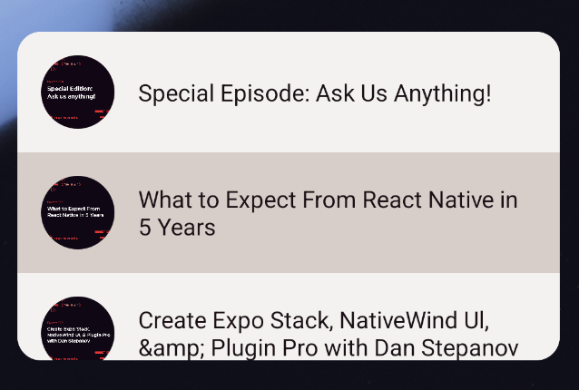

# Module 05: When an icon isn’t enough / Widgets :yellow_heart: apps

### Goal

Learn how to use config plugins like `react-native-android-widget` and `expo-apple-targets` to extend our app far beyond its screens and icon, creating home screen widgets that read data from our app.

### Concepts

- Making a widget available for Android and iOS when your app is installed
- Sharing data with that widget
- Light widget design and styling

### Features to build

- Android: a widget that scrolls through recent podcast episodes, letting you tap an episode and navigate to it.
- iOS: a widget that shows X episodes based on its size (TODO: what are the limits of showing data on an iOS widget? I don't think they can scroll)

### Resources

- [iOS Human Interface Guidelines on Widgets](https://developer.apple.com/design/human-interface-guidelines/widgets)
- [Android Widgets Overview](https://developer.android.com/develop/ui/views/appwidgets/overview)

# Exercises

## Exercise 0: Get organized

In Android, much of what you'll do with widgets will be in TypeScript/JSX. It'll fit neatly within your `src` folder.

On iOS, there's some Swift UI, some JSON, some Expo Modules API stuff, a little TypeScript... phew! Some of it can go wherever, but some of it needs to go in specific places in your project. So, we're going to try our best, keeping widget-related TS in a **src/widgets** folder, and putting the rest where it needs to go.

1. Create the **src/widgets** folder. Cross-platform code will go in the root here.
2. Create the **src/widgets/android** folder. Android-platform-specific TS will go in the root here. There will be a lot of this.
3. Create the **src/widgets/ios** folder. There will only be a little code here.
4. Create the **targets** folder on the root. This is where general Apple targets files will go, which will be used by the `expo-apple-targets` config plugin.
5. Create the **modules** folder on the root. Any Expo Modules API code we write to wrap native functions that aren't already exposed will go here.

## Exercise 1(a): "Hello, Widget!" on Android

Let's do the absolute minimum with `react-native-android-widget` to get a very basic "Hello World" widget on our home screen. Once we do that, we will have much of what we need in place to start making the widget useful.

1. Run `yarn add react-native-android-widget` to add the package.

2. Add the `react-native-android-widget` configuration to your `plugins` array in **app.json**:

```json
[
  "react-native-android-widget",
  {
    "widgets": [
      {
        "name": "Hello", // This name will be the **name** with which we will reference our widget.
        "label": "My Hello Widget", // Label shown in the widget picker
        "minWidth": "320dp",
        "minHeight": "120dp",
        // This means the widget's default size is 5x2 cells, as specified by the targetCellWidth and targetCellHeight attributes.
        // Or 320×120dp, as specified by minWidth and minHeight for devices running Android 11 or lower.
        // If defined, targetCellWidth,targetCellHeight attributes are used instead of minWidth or minHeight.
        "targetCellWidth": 5,
        "targetCellHeight": 2,
        "description": "This is my first widget", // Description shown in the widget picker

        // How often, in milliseconds, that this AppWidget wants to be updated.
        // The task handler will be called with widgetAction = 'UPDATE_WIDGET'.
        // Default is 0 (no automatic updates)
        // Minimum is 1800000 (30 minutes == 30 * 60 * 1000).
        "updatePeriodMillis": 1800000
      }
    ]
  }
]
```

3. Create **src/widgets/android/HelloWidget.tsx** with the following code:

```tsx
import React from "react";
import { FlexWidget, TextWidget } from "react-native-android-widget";

export function HelloWidget() {
  return (
    <FlexWidget
      clickAction="OPEN_APP"
      style={{
        height: "match_parent",
        width: "match_parent",
        justifyContent: "center",
        alignItems: "center",
        backgroundColor: "#ffffff",
        borderRadius: 16,
      }}
    >
      <TextWidget
        text="Hello widget"
        style={{
          fontSize: 32,
          fontFamily: "Inter",
          color: "#000000",
        }}
      />
    </FlexWidget>
  );
}
```

This is a special limited form of JSX that can be used by `react-native-android-widget` render Android widgets. You can't use regular React Native components or hooks here.

4. Create **src/widgets/android/widget-task-handler.tsx** with the following code:

```tsx
import React from "react";
import type { WidgetTaskHandlerProps } from "react-native-android-widget";
import { HelloWidget } from "./HelloWidget";

export async function widgetTaskHandler(props: WidgetTaskHandlerProps) {
  switch (props.widgetAction) {
    case "WIDGET_ADDED":
    case "WIDGET_UPDATE":
    case "WIDGET_RESIZED":
      props.renderWidget(<HelloWidget />);
      break;
    default:
      break;
  }
}
```

This will respond to widget events triggered by the Android OS.

> Note that you can read `widgetAction` to see _which_ widget the OS wants you to update. You can use this to branch your code for different widgets. We're just going to have one widget, though, so we will not bother with that.

5. In order for our app to respond quickly to widget tasks coming from the OS without spinning up the whole app, we need to modify our app's entry point.

Create **src/main.tsx** and add this code, which is mostly adapted from the default Expo Router entry point, plus the widget task handler code specified in the `react-native-android-widget` docs:

```tsx
// `@expo/metro-runtime` MUST be the first import to ensure Fast Refresh works
// on web.
import "@expo/metro-runtime";

import { App } from "expo-router/build/qualified-entry";
import { renderRootComponent } from "expo-router/build/renderRootComponent";
import { registerWidgetTaskHandler } from "react-native-android-widget";

import { widgetTaskHandler } from "./widgets/android/widget-task-handler";

// This file should only import and register the root. No components or exports
// should be added here.
renderRootComponent(App);

registerWidgetTaskHandler(widgetTaskHandler);
```

6. Update **package.json** to use the new entry point:

```diff
- "main": "expo-router/entry",
+ "main": "src/main.tsx",
```

🏃**Try it.** Run `npx expo prebuild --clean` and `npx expo run:android`. Then try to add your widget by long-pressing on the app icon and choosing "Widgets" (if the widgets menu option doesn't show, that's a sign that something went wrong, especially in the first few steps).

## Exercise 1(i): "Hello, Widget!" on iOS

Let's do the minimum with `@bacons/apple-target` to get a very basic "Hello World" widget on our home screen on iOS.

1. Run `yarn add @bacons/apple-targets` to install the config plugin.

2. Add the following to your `plugins` array in **app.json** to configure the widget:

```json
[
  "@bacons/apple-targets",
  {
    "appleTeamId": "XXXXXXXXX"
  }
],
```

> The team ID will be needed to run on a device, but we can fake it to keep working quickly in simulator-land.

2. Create the **targets/widgets** folder.

3. Create the **targets/widgets/expo-target.config.js** with the following contents:

```
/** @type {import('@bacons/apple-targets').Config} */
module.exports = {
  type: "widget",
  colors: {
    $accent: "#F09458",
    $widgetBackground: "#DB739C",
  },
  "deploymentTarget": "17.0"
};
```

4. Copy the contents [widgets.swift](files/05/ios/widgets.swift) into the **target/widgets/widgets.swift** file.

This file defines the SwiftUI code for our widget. This one is the default file XCode would generate for you if you made a widget in there. We'll come back to this.

5. Create **target/widgets/index.swift** and paste in the following:

```swift
import WidgetKit
import SwiftUI

@main
struct exportWidgets: WidgetBundle {
    var body: some Widget {
        // Export widgets here
        HelloWidget()
    }
}
```

This is where you tell XCode what code you're using to generate your widgets.

🏃**Try it.** Run `npx expo prebuild --clean` and `npx expo run:ios`. You should be able to find your widget by pressing the "+" button on the widgets panel and typing in `cr2024-im` in the search (they don't populate on the simulator by default, not sure why).

You'll see some new files show up in **target/widgets**. This happens on Prebuild via `expo-apple-targets`. It turns that **expo-target.config.js** file into files needed by XCode for widget integration.

## Exercise 2: Getting ready for widget data flow

Our actual widget is going to display favorited episodes of the podcast. It will be a little different for Android and iOS, due to the different features widgets offer on each platform. The data will be refreshed a little differently on each platform, as well, but it needs to be refreshed at the same time.

So, let's make a stub function for refreshing the widget whenever your app data changes, so we'll be ready to drop code in there as we add each widget. We'll call the stub at each point where we want to refresh the data, which is when a) the favorites change, or b) at some other convenient point, so any code changes to the widget can be picked up ASAP (e.g., on app foreground).

1. Create **src/widgets/widget-refresher.tsx**, and add this code:

```tsx
import { Platform } from "react-native";
import { Episode } from "src/models/Episode";

export const updateEpisodesWidget = (episodes: Episode[]) => {
  if (Platform.OS === "android") {
    // refresh android widget here
  }
  if (Platform.OS === "ios") {
    // refresh iOS widget here
  }
};
```

2. In **EpisodeStore.ts**, import the refresh function:

```ts
import { updateEpisodesWidget } from "../widgets/widget-refresher";
```

and call it when updating favorites:

```diff
addFavorite(episode: Episode) {
  store.favorites.push(episode)
+  updateEpisodesWidget(store.favorites.slice())
},
removeFavorite(episode: Episode) {
  store.favorites.remove(episode)
+  updateEpisodesWidget(store.favorites.slice())
},
```

3. In the post-login layout (**src/app/(app)/\_layout.tsx**), import the refresh function and `AppState`:

```tsx
import { AppState } from "react-native";
import { updateEpisodesWidget } from "../../widgets/widget-refresher";
```

grab `episodeStore` from `useStores()`:

```diff
const {
    authenticationStore: { isAuthenticated },
+    episodeStore,
  } = useStores()
```

and add a listener to refresh the widget on resume from background:

```tsx
React.useEffect(() => {
  const subscription = AppState.addEventListener("change", (appState) => {
    if (appState === "active") {
      updateEpisodesWidget(episodeStore.favorites.slice());
    }
  });

  return () => {
    subscription.remove();
  };
}, []);
```

🏃**Try it (if you want to).** It shouldn't break anything, but it also shouldn't do anything yet.

## Exercise 3(a) and 3(i): Choose-your-own-widget-adventure

We're going to make the widgets do something useful- showing the favorite episodes of the podcast, updating the widget each time a podcast's favorite status is changed. We'll make each widget slightly different, based on the capabilities offered by the OS:

- **Android**: scroll through a list of favorite podcasts. Tapping a podcast will deep link you to that podcast.
- **iOS**: show the latest favorite podcast and a badge indicating how many other podcasts are favorited. Implement different styles for the small and medium widget form factors. Deep link to the latest podcast on tap.

At this point, you can decide which widget you'd like to work on first. Use the links below to navigate to the remaining instructions for each widget. Once you're done with one, come back for the other:

- [Android favorite podcasts widget instructions](/companions/05/05a-android-podcast-widget.md)
- [iOS favorite podcasts widget instructions](/companions/05/05i-ios-podcast-widget.md)

[](./assets/05/android-widget.png)

[](./assets/05/ios-widget.png)

## Side Quests

- Add any extra stuff to do here

## See the solution

Switch to branch: `05-widgets-solution`
