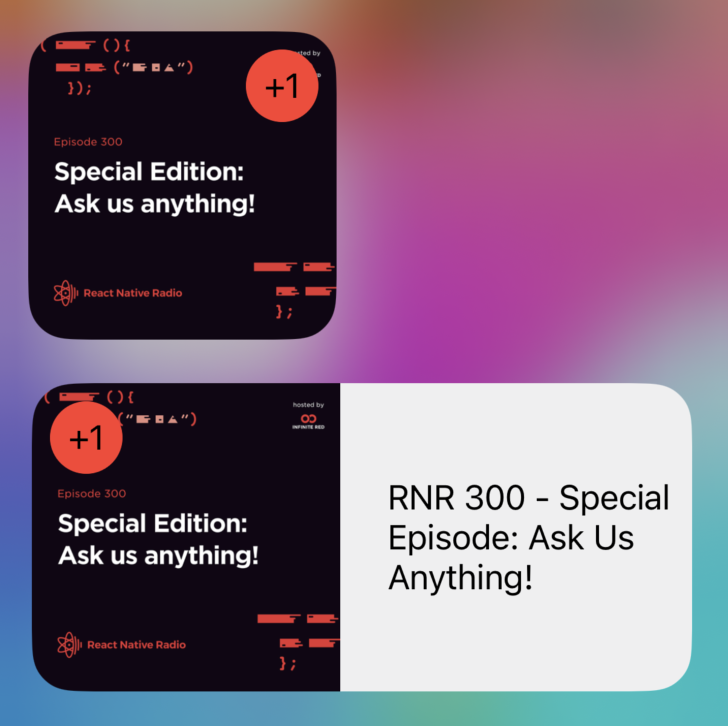
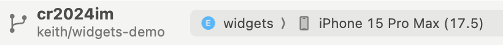

# Creating the iOS Podcast Widget

## Background

These instructions continue where Module 05 left off, describing how to transform your "hello" widget into one that displays information about favorited podcasts.

## Renaming things
Let's rename `HelloWidget` to `FavoriteEpisodeWidget`:
- In **widgets.swift**, change references to `HelloWidgetEntryView` to `FavoriteEpisodeWidgetEntryView`.
- Also in **widgets.swift**, change references to `HelloWidget` to `FavoriteEpisodeWidget`.
- In **index.swift**, change references to `HelloWidget` to `FavoriteEpisodeWidget`.

## Setting up data sharing
iOS widget extensions are technically separate app bundles, so we need to setup an "app group" to share data between the main app and the widget app. The app group is an arbitrary identifier built into both the main app and its widget extension. This group defines a shared file and data space that both can access.

1. In **app.json**, under `expo.ios`, add the app group entitlement. This defines the app group for the main app:

```json
 "entitlements": {
  "com.apple.security.application-groups": ["group.cr2024im.data"]
}
```

2. In **targets/widgets/expo-target.config.js**, add the same entitlement:

```js
entitlements: {
  "com.apple.security.application-groups": ["group.cr2024im.data"],
},
```

Once we rebuild, both main app and widget could read and write to a shared location. But, before we do that, let's setup some native code that will write to the shared location and refresh the widget at the same time.

## The smallest Expo Module ever: update the widget on-demand

We're going to create a very small Expo Module to let us access this native command to write to shared preferences - a small, efficient data store available to apps, and refresh the widget at the same time. We will put this native code in a local Expo Module, a folder inside our app where we can place native code and it will get compiled with our app.

1. Create the local Expo Module by running:

```bash
npx create-expo-module@latest --local
```

Name it `ios-widget-refresh`.

2. This is an iOS-only module, so let's a delete a bunch of files we don't need. When you're done, these should be the **only** files:

- **index.ts**
- **expo-module.config.json**
- **ios**:
  - **IosWidgetRefreshModule.swift**
  - **IosWidgetRefresh.podspec**

3. For iOS, the function signature can be automatically inferred from native code, so we're going update **index.ts** to do just that:

```ts
import { requireOptionalNativeModule } from "expo-modules-core";

export default requireOptionalNativeModule("IosWidgetRefresh");
```

4. In **IosWidgetRefreshModule.swift** replace the code with something that writes to shared preferences and then refreshes the widget:

```swift
import ExpoModulesCore
import WidgetKit

public class IosWidgetRefreshModule: Module {
public func definition() -> ModuleDefinition {
    // Name of the module as used in JS
    Name("IosWidgetRefresh")

    // Function to call from JS
    Function("set") { (key: String, value: String, group: String?) in
      let userDefaults = UserDefaults(
        // The group name is the same as the App Group name
        suiteName: group
      )
      userDefaults?.set(value, forKey: key)

      // Trigger a widget update to sync the data
      if #available(iOS 14.0, *) {
          WidgetCenter.shared.reloadAllTimelines()
      }
    }
  }
}
```

5. Now that we have a native module, we can use it in **widget-refresher.tsx**. Import the native module functionality:

```tsx
import IosWidgetRefresh from "../../modules/ios-widget-refresh";
```

and call it in the `Platform.OS === "ios"` block:

```tsx
IosWidgetRefresh.set( "episodes", JSON.stringify(episodes.slice()), "group.cr2024im.data")
```

> It would probably be better if this function took an array of episodes, but this is simple, and a nice thing about a generic refresh function that parses the data on the other end is that it could refresh _any_ widget.

🏃**Try it.** Run `npx expo prebuild --clean` and `npx expo run:ios`. Nothing will change yet, but now that the native code is built into your app, along with the app group, calling the widget refresh code shouldn't crash anything.

## Show the shared data in the widget

Here's where things get a little intense, at least if you haven't done much with Swift before. We need to parse that JSON data, add it to the "timeline" (the next thing to display on a widget), and render it in SwiftUI.

Actually, some of this is easy (showing one widget form factor, displaying text on the widget), and some of this is harder (downloading the thumbnail async). Let's start with the easy stuff.

Unlike on Android, iOS widgets can't scroll. There's some things we could do with buttons, but then we would also need additional state tracking, and it would get pretty complicated fast. So, we're going to focus on displaying the latest favorited podcast, with a count of additional favorites as a badge:

[](../../assets/05/ios-widget.png)

For the section, everything all the work will be in **widgets.swift**.

> Opening up your `ios` folder in Xcode at this point is highly recommended! You'll get Swift syntax highlighting when you edit **widgets.swift** in there.

<!-- TODO: demonstrate prebuild without RN to make widget preview work -->

### Basic text data flow to the widget

1. The SwiftUI rendering structs play nicely with data structures that closely match what they're going to render, so update `SimpleEntry` to contain just what we'll ultimately need when rendering:

```swift
struct SimpleEntry: TimelineEntry {
  let date: Date
  let title: String
  var imageData: UIImage?
  let episodeCount: Int
  let guid: String?
}
```

This struct will also account for there being no favorite; we'll do that based on a `nil` guid.

2. We also need a `Codable` struct to help with parsing our episode JSON. Add this at the top level of the file:

```swift
struct EpisodeFromStore: Codable {
  let guid: String
  let title: String
  let thumbnail: String
}
```

3. Replace `getTimeline` with this code. This will read the JSON into a list, munge the first episode data into `SimpleEntry`, and also provide an empty state if there's no episodes:

```swift
func getTimeline(in context: Context, completion: @escaping (Timeline<Entry>) -> ()) {
  // Notice the App Group is used here
  let userDefaults = UserDefaults(suiteName: "group.cr2024im.data")
  // And the key for the data that we use in the MST store.
  let episodesJsonString = userDefaults?.string(forKey: "episodes") ?? "[]"

  let decoded: [EpisodeFromStore] = try! JSONDecoder().decode([EpisodeFromStore].self, from: Data(episodesJsonString.utf8))

  let firstEpisode = decoded.first

  if (firstEpisode != nil) {
    // pass the data to the widget
    let entry = SimpleEntry(date: Date(), title: firstEpisode?.title ?? "", imageData: nil, episodeCount: decoded.count, guid: firstEpisode?.guid)

    // Some other stuff to make the widget update...
    let timeline = Timeline(entries: [entry], policy: .atEnd)
    completion(timeline)
  } else {
    // pass the data to the widget
    let entry = SimpleEntry(date: Date(), title: "", imageData: nil, episodeCount: 0, guid: nil)

    // Some other stuff to make the widget update...
    let timeline = Timeline(entries: [entry], policy: .atEnd)
    completion(timeline)
  }
}
```

4. Update `placeholder` and `getSnapshot` with placeholder data:

```swift
func placeholder(in context: Context) -> SimpleEntry {
  SimpleEntry(date: Date(), title: "RNR 1: The First One", imageData: nil, episodeCount: 1, guid: nil)
}

func getSnapshot(in context: Context, completion: @escaping (SimpleEntry) -> ()) {
  let entry = SimpleEntry(date: Date(), title: "RNR 1: The First One", imageData: nil, episodeCount: 1, guid: nil)
  completion(entry)
}
```

Do the same with the `#Preview` at the bottom:

```swift
#Preview(as: .systemSmall) {
    FavoriteEpisodeWidget()
} timeline: {
  SimpleEntry(date: Date(), title: "RNR 1: The First One", imageData: nil, episodeCount: 1, guid: nil)
}
```

5. Update `FavoriteEpisodeWidgetEntryView` to render the title. This will also cover the empty state:

```swift
struct FavoriteEpisodeWidgetEntryView : View {
  var entry: Provider.Entry

  var body: some View {
    VStack {
      if (entry.episodeCount == 0) {
        Text("No favorite episodes yet!")
      } else {
        Text(entry.title)
      }
    }
  }
}
```

🏃**Try it.** You will need to rebuild. You could run `npx expo prebuild --clean; npx expo run:ios`, or, since you're already in XCode, just rebuild the widget. Switch to the widget target, press play, and then open the app to trigger the refresh.

[](../../assets/05/build-widget.png)

This open also allows you to add debugging breakpoints to the widget code.

## Make the widget look nice

Let's add the thumbnail image and extra favorite podcast badge to finish making this widget look presentable.

### Downloading and displaying the image

SwiftUI has a nice `AsyncImage` component that could take a URL and download an image, but... it doesn't work in widgets! Everything has to be synchronous, so the image needs to be downloaded first in `getTimeline`.

1. Add this code at the top level of the file (not inside any structs). It's not that important what it does, but you can read the comments below:

```swift
// just an error definition in case a fetch fails
enum FetcherError: Error {
    case imageDataCorrupted
}

// It turns out that those thumbnails are really high-res, and Swift will get mad if you don't shrink them. This makes that easier.
extension UIImage {
  func resized(toWidth width: CGFloat, isOpaque: Bool = true) -> UIImage? {
    let canvas = CGSize(width: width, height: CGFloat(ceil(width/size.width * size.height)))
    let format = imageRendererFormat
    format.opaque = isOpaque
    return UIGraphicsImageRenderer(size: canvas, format: format).image {
      _ in draw(in: CGRect(origin: .zero, size: canvas))
    }
  }
}
```

2. Downloading involves multithreading, and it's just easier if you break that out into a separate function. So, put this inside the `Provider` struct:

```swift
func fetchImage(url: String) async throws -> UIImage {
  // Download image from URL
  let (imageData, _) = try await URLSession.shared.data(from: URL(string: url)!)

  guard let image = UIImage(data: imageData) else {
    throw FetcherError.imageDataCorrupted
  }

  return image
}
```

3. Here's the new `getTimeline`. Replace `getTimeline` with this code. Notice that we a) wrap it in a `Task` to support async code, b) return and don't update the widget if image downloading fails, and c) use the resize before setting the `imageData` in `SimpleEntry`, so SwiftUI gets a smaller image:

```swift
  func getTimeline(in context: Context, completion: @escaping (Timeline<Entry>) -> ()) {
    Task {
      // Notice the App Group is used here
      let userDefaults = UserDefaults(suiteName: "group.cr2024im.data")
      // And the key for the data that we use in the MST store.
      let episodesJsonString = userDefaults?.string(forKey: "episodes") ?? "[]"

      let decoded: [EpisodeFromStore] = try! JSONDecoder().decode([EpisodeFromStore].self, from: Data(episodesJsonString.utf8))

      let firstEpisode = decoded.first

      if (firstEpisode != nil) {
        guard let image = try? await fetchImage(url: firstEpisode?.thumbnail ?? "") else {
          return
        }

        // pass the data to the widget
        let entry = SimpleEntry(date: Date(), title: firstEpisode?.title ?? "", imageData: image.resized(toWidth: 500), episodeCount: decoded.count, guid: firstEpisode?.guid)

        // Some other stuff to make the widget update...
        let timeline = Timeline(entries: [entry], policy: .atEnd)
        completion(timeline)
      } else {
        // pass the data to the widget
        let entry = SimpleEntry(date: Date(), title: "", imageData: nil, episodeCount: 0, guid: nil)

        // Some other stuff to make the widget update...
        let timeline = Timeline(entries: [entry], policy: .atEnd)
        completion(timeline)
      }
    }
  }
```

4. In `FavoriteEpisodeWidgetEntryView`, replace `Text(entry.title)` with a horizontal stack that shows the image side-by-side with the title:

```swift
HStack {
  if (entry.imageData !== nil) {
    GeometryReader { geo in
      //You now have access to geo.size.width and geo.size.height

      Image(uiImage: entry.imageData!)
        .resizable()
        .scaledToFill()
        .frame(width: geo.size.height, height: geo.size.height)
    }
  }
  Text(entry.title)
    .padding(EdgeInsets(top: 0, leading: 10, bottom: 0, trailing: 10))
}
```

🏃**Try it.** Rebuild the widget. You should see the image. It might not look great yet. Try adding small, medium, and large widget sizes to your home screen. Which look the best? How are the margins?

### Multiple size support and other cleanup

There's some large padding around the widget content that you didn't intend to be there. Also, the different sizes don't all look great. Medium is probably the best one. Optimally, we'd make them all work well, but we'll focus on small and medium right now.

5. Update `FavoriteEpisodeWidget` with this to limit the sizes and fix the margins:

```diff
struct FavoriteEpisodeWidget: Widget {
  let kind: String = "FavoriteEpisodeWidget"

  var body: some WidgetConfiguration {
    StaticConfiguration(kind: kind, provider: Provider()) { entry in
      if #available(iOS 17.0, *) {
        FavoriteEpisodeWidgetEntryView(entry: entry)
          .containerBackground(.fill.tertiary, for: .widget)
      } else {
        FavoriteEpisodeWidgetEntryView(entry: entry)
          .padding()
          .background()
      }
    }
+    .supportedFamilies([.systemSmall, .systemMedium]) // limits the available sizes
+    .contentMarginsDisabled() // gets rid of the margin
    .configurationDisplayName("My Widget")
    .description("This is an example widget.")
  }
}
```

🏃**Try it.** Hopefully medium looks pretty good now! Small will still be squished. Large should disappear if you added it to your home screen.

6. We need to break out the widget SwiftUI into multiple sizes. A good way to do this is to provide separate components for each size. This will be a big copy/paste chunk, mostly because this isn't a SwiftUI workshop and we don't want to spend a lot of time fiddling with this. Replace `FavoriteEpisodeWidgetEntryView` with this:

```swift
struct WidgetSmallView : View {
  var entry: Provider.Entry

  var body: some View {
    VStack {
      if (entry.episodeCount == 0) {
        Text("No favorite episodes yet!")
      } else {
        ZStack {
          HStack {
            if (entry.imageData !== nil) {
              Image(uiImage: entry.imageData!)
                .resizable()
                .scaledToFill()
                .cornerRadius(10)
            }
          }
        }
      }
    }
  }
}

struct WidgetMediumView : View {
  var entry: Provider.Entry

  var body: some View {
    VStack {
      if (entry.episodeCount == 0) {
        Text("No favorite episodes yet!")
      } else {
        ZStack {
          HStack {
            if (entry.imageData !== nil) {
              GeometryReader { geo in
                //You now have access to geo.size.width and geo.size.height

                Image(uiImage: entry.imageData!)
                  .resizable()
                  .scaledToFill()
                  .frame(width: geo.size.height, height: geo.size.height)
              }
            }
            Text(entry.title)
              .padding(EdgeInsets(top: 0, leading: 10, bottom: 0, trailing: 10))
          }
        }
      }
    }
  }
}

struct FavoriteEpisodeWidgetEntryView : View {
  var entry: Provider.Entry

  @Environment(\.widgetFamily) var family: WidgetFamily
  @ViewBuilder
  var body: some View {
    switch family {
    case .systemSmall:
      WidgetSmallView(entry: entry)
    case .systemMedium:
      WidgetMediumView(entry: entry)
    default:
      EmptyView()
    }
  }
}
```

That `@ViewBuilder` attribute lets us compose our widget of multiple different components based on `widgetFamily`. For the small widget, we removed the text and let the image take over the entire space.

🏃**Try it.** Make sure both the small and medium widgets are on your home screen. They should look pretty nice now.

### The badge

Notice the `ZStack` added to the widget components? That will help us overlay a badge when there's more than one favorited episode.

7. In the medium widget, add this code inside the `ZStack`, right under the `HStack` containing the image and text:

```swift
if (entry.episodeCount > 1) {
  VStack {
    HStack {
      ZStack {
        Circle().fill(Color(red: 213 / 255, green: 70 / 255, blue: 63 / 255, opacity: 1))
          .padding(EdgeInsets(top: 10, leading: 10, bottom: 10, trailing: 10))
        Text("+\((entry.episodeCount - 1).description)")
      }.frame(width: 60, height: 60)
      Spacer()
    }
    Spacer()
  }
}
```

The outer `ZStack` stacks this view directly on top of the image/text, and the `VStack`'s and `Spacer`'s combine to position the badge in the top-left. Think of this view as getting split into four quadrants. First it's split vertically, and then the top is split horizontally, with the first part containing the badge and the second part containing a spacer.

8. In the small widget, add this code inside the `ZStack`, right under the `HStack` containing the image and text:

```swift
if (entry.episodeCount > 1) {
  VStack {
    HStack {
      Spacer()
      ZStack {
        Circle().fill(Color.red)
          .padding(EdgeInsets(top: 10, leading: 10, bottom: 10, trailing: 10))
        Text("+\((entry.episodeCount - 1).description)")
      }.frame(width: 60, height: 60)
    }
    Spacer()
  }
}
```

Almost the same thing, except we're placing the badge in the top-right.

🏃**Try it.** Add multiple favorites, and see what happens!

## Add some deep linking

Since we only show one podcast at once, we can't really let the user select from multple podcasts, at least not without adding buttons, state, etc. But, we can affect the click action on the entire widget to navigate to the displayed podcast if there is one, and to the podcasts screen if none are selected.

Update `FavoriteEpisodePodcastEntryView` to link to the respective deep links for each widget size:

```diff
struct FavoriteEpisodePodcastEntryView : View {
  var entry: Provider.Entry

  @Environment(\.widgetFamily) var family: WidgetFamily
  @ViewBuilder
  var body: some View {
    switch family {
    case .systemSmall:
      WidgetSmallView(entry: entry)
+        .widgetURL(URL(string: "cr2024-im://podcasts/\(entry.guid ?? "")"))
    case .systemMedium:
      WidgetMediumView(entry: entry)
+        .widgetURL(URL(string: "cr2024-im://podcasts/\(entry.guid ?? "")"))
    default:
      EmptyView()
    }
  }
}
```

🏃**Try it.** Tap on the widget both with and without any favorites selected.

## Side Quests
You could theme your widget for dark mode by following the guidance in Evan Bacon's [Apple Home Screen Widgets with Expo CNG](https://evanbacon.dev/blog/apple-home-screen-widgets).